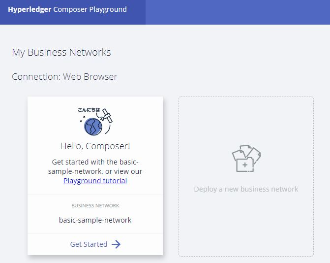
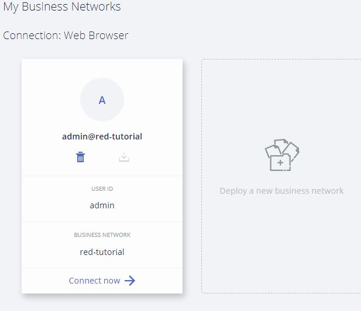

# Práctica 4. Introducción a Hyperledger
José Incera. Marzo 2018

### 1.	Objetivos

- Familiarizarse con los principales conceptos del ambiente Hyperledger Composer
- Desplegar en web una aplicación muy sencilla modelada con el lenguaje CTO

### 2. Introducción

Hyperledger Composer ha sido liberado recientemente dentro del projecto HyperLedger de la *Linux Foundation*. Consiste de un conjunto de herramientas que simplifican el despliegue de aplicaciones en blockchain.  Está compuesto de:

- Un lenguaje de modelado llamado CTO en recuerdo a su ancestro, llamado *Concerto*
- Una interfaz de usuario llamada **Hyperledger Composer Playground**. Permite configurar, desplegar y probar rápidamente una red de negocio
- Herramientas en línea de comandos para integrar redes de negocio modeladas con Composer, a una instancia en ejecución de Hyperledger Fabric.

Las redes de negocio diseñadas en Composer pueden desplegarse en un blockchain Hyperledger Fabric o simuladas en un navegador con ayuda del Playground sin necesidad de instalar herramientas adicionales en la computadora.  En esta práctica "desplegaremos" la red en un navegador y en la siguiente lo haremos en un ambiente controlado de Hyperledger Fabric.

La práctica está inspirada en el siguiente tutorial de Hyperledger: [https://hyperledger.github.io/composer/tutorials/playground-tutorial.html
](https://hyperledger.github.io/composer/tutorials/playground-tutorial.html
)

### Algunas definiciones
Los objetos que se manejan en el lenguaje de modelado son:
#### Activos
Un activo es **cualquier cosa** que tenga un valor percibido y que pueda ser intercambiado entre los participantes en un acuerdo de negocio.
Ejemplos de activos son: 
- monedas, 
- una casa, 
- una caja de plátanos, 
- un embarque de plátanos, 
- un contrato para un embarque a determinado precio si las condiciones se cumplen.

#### Participantes
Un *participante* es un miembro de la red de negocio. 

#### Control de acceso
En una red de negocio no todos los participantes tienen acceso a todo. El *control de acceso* establece quién tiene acceso a qué.

#### Transacciones
Definimos transacción, como las interacciones sobre un activo que pudieran modificar el estado del blockchain.  Ejemplos de transacciones son:
- Un sensor hace y registra una lectura de temperatura
- Un participante vende una casa
- Un sensor GPS registra la ubicación de una persona

Las transacciones son las reglas de negocio (es decir, los *Smart Contracts*) del sistema.


### 3. Desarrollo

Vamos a diseñar una red de negocio en la que definiremos activos, participantes y transacciones sujetas a reglas de negocio. El ambiente es proporcionado por IBM Bluemix

#####3.1.- Abrir el Playground del Composer en web

Abra el *Hyperledger Composer Playground* [https://composer-playground.mybluemix.net/](https://composer-playground.mybluemix.net/).  Tras la página de bienvenida, veremos la página *My Business Networks* con un resumen de las redes a las que nos podemos conectar y las entidades que podemos usar.

#####3.2.- Crear nuestra red de negocio
Vamos a crear nuestra propia red. Una red de negocios tiene varias propiedades, como un nombre y una descripción opcional. De clic en **Deploy a new business network**.



Démosle el nombre *red-tutorial*. Opcionalmente podemos agregar una descripción.  También podemos agregar la cuenta del administrador, por ejemplo admin@red-tutorial*.

Podemos elegir a partir de qué red ya desplegada podemos crear la nuestra.  En este caso, no queremos de ninguna y damos clic en **empty-business-network** y después en **Deploy**.


#####3.3.- Conexión a la red

Ahora debemos conectarnos a la red de negocios que acabamos de desplegar. Veremos una nueva tarjeta de red llamada `red-tutorial` con un identificador de usuario `admin.`



En el Composer Playground a través de Web, las redes están representadas por **Tarjetas de identificación** (*ID cards*).  Estas tarjetas tienen todos los elementos necesarios (detalles de conexión, credenciales de autenticación y metadata) para conectarnos a la red correspondiente, ya sea la de este tutorial o una blockchain externo. Dar clic en **Connect now ->**.

#####3.4.- Agregar un archivo de modelo

Como puede observar, estamos en el tab `Define,` que es donde se crean y editan los archivos para definir la red de negocios.

Como se seleccionó una plantilla vacía, será necesario definir nuestros archivos de red de negocios.  El primer paso consiste en agregar un **archivo de modelo**. Son archivos donde se definen los activos, participantes, transacciones y eventos de nuestra red.

De clic en la opción **Add a file**, seleccione **Model file** y de clic en **Add**. Elimine las líneas que están en la plantilla y sustitúyalas por el código siguiente:

```js
/**
 * Mi primera red.
 * Intercambia bienes inmuebles
 */
namespace org.acme.mired
asset Casa identified by idCasa {
    o String idCasa
    o String descripcion
    o String mainExchange
    o Double cantidad
    --> Negociante propietario
}
participant Negociante identified by idNegociante {
    o String idNegociante
    o String Nombre
    o String Apellido
}
transaction Vende {
    --> Casa casa
    --> Negociante nuevoPropietario
}
```
En este modelo se definió un solo activo de tipo `Casa,` un solo participante de tipo `Negociante` y una sola transacción de tipo `Vende` que se usará para cambiar al propietario de la propiedad.

**Observe que abajo de la ventana se está validando el código en tiempo real**.

#####3.5.- Agregar un procesador de transacción desde un archivo.

Ahora podemos definir la lógica de negocio para las transacciones en nuestra red. En `Composer` esta lógica de negocio se expresa como funciones `javaScript.`  Estas funciones se ejecutan automáticamente cuando se somete una transación para su procesamiento.

De nuevamente clic en la opción **Add a file** pero esta vez seleccione **Script file** y después de clic en **Add**. Remplace las líneas que están en la plantilla por el código siguiente:

```js
/**
 * De seguimiento al cambio de una propiedad de un Propietario a otro
 * @param {org.acme.mired.Vende} trade - el intercambio de Propiedad a procesar
 * @transaction
 */
 
function transfiereCasa(vende) {
    vende.casa.propietario = vende.nuevoPropietario;
    return getAssetRegistry('org.acme.mired.Casa')
        .then(function (assetRegistry) {
            return assetRegistry.update(vende.casa);
        });
}
```
Esta función simplemente cambia el *propietario* de una casa con la recepción de una transacción *Vende*, toma la *Casa* y la regresa modificada al *assetRegistry* utilizado para almacenar instancias de  *Casa*.

#####3.6.- Control de acceso

Los archivos de control de acceso definen las reglas para acceder a las redes de negocio.  Como nuestra red es muy simple, no necesitamos editar el archivo de control de acceso que se crea por default. Este archivo le da al participante actual `networkAdmin` acceso total a la red de negocio y a las operaciones a nivel *Sistema*.

Una red de negocio puede tener varios archivos `model` o `script`, pero solamente puede tener un archivo de control de acceso.

#####3.7.- Desplegar y probar la red de negocio

Ya que han sido creados los tres archivos (`model` `script` y `access control`), debemos desplegar y probar nuestra red de negocio. Simplemente de clic en el botón **Deploy changes**.

Para probar nuestra red vamos a crear algunos participantes (los "Negociantes"), un activo (una "Casa") y utilizaremos la transacción "Vende" para cambiar la propiedad de una Casa.

Para empezar, de clic en **Test**. Aparece una pantalla como la siguiente:


**3.7.1.- Crear participantes**

Lo primero que se debe hacer en una nueva red de negocio, es agregar al menos un par de participantes.  Asegúrese de que tiene la pestaña `Negociante` en el menú de la izquierda, activada y de click en **Create New Participant** en el botón que se encuentra arriba a la derecha.

Aparece la estructura de un *Negociante*. Modifíquela para que quede de la siguiente manera:

```js
    {
      "$class": "org.acme.mired.Negociante",
      "idNegociante": "NEGOC1",
      "firstName": "Luis",
      "lastName": "Garcia"
    }
```

De clic en **Create New** para crear al nuevo participante. Debe ver al miembro recién creado.

Necesitamos un segundo participante. Lo crearemos igual pero en esta ocasión el identificador es NEGOC2 y el nombre, Rita Ortega.
```js
    {
      "$class": "org.acme.mired.Negociante",
      "idNegociante": "NEGOC2",
      "firstName": "Rita",
      "lastName": "Ortega"
    }
```
Asegúrese de que aparecen los dos participantes en la pantalla de `Negociante` antes de continuar.

**3.7.2.- Crear un activo**

La creación de activos es muy similar a la creación de participantes.  El activo que crearemos (una Casa) tendrá un propietario;  lo iniciaremos con el primero que creamos, `NEGOC1.`

De clic en **ASSETS/Casa** y modifique la plantilla que aparece para que quede como ésta:

```js
{
  "$class": "org.acme.mired.Casa",
  "idCasa": "ABC",
  "descripcion": "Casa de prueba",
  "mainExchange": "Euronext",
  "quantity": 1,
  "owner": "resource:org.acme.mired.Negociante#NEGOC1"
    }
```
De clic en **Create New**; deberá ver el activo creado en la pantalla:


**3.7.3.- Transferir el activo**

Ahora es el turno de probar nuestra transacción `Vende.`  Las transacciones son la base de todo cambio en una red de negocio en Hyperledger Composer. De clic en el botón **Submit Transaction** en el extremo inferior del menú izquierdo. En la plantilla que aparece, asegúrese que se trata de una transaccion tipo `Vende.` Modifique la plantilla con los datos que necesitamos para ejecutar la transacción:

```js
{
  "$class": "org.acme.mired.Venta",
  "casa": "resource:org.acme.mired.Casa#ABC",
  "nuevoPropietario": "resource:org.acme.mired.Negociante#NEGOC2"
}
```

**Para este tutorial, estamos ejecutando códigos muy básicos.  Por ejemplo, aquí ni siquiera estamos verificando que existan la propiedad o el nuevo dueño.**

De clic en **Submit**. Si todo está correcto, debió ver una ventana temporal indicando que la transacción fue enviada correctamente.

Para verificar que la regla de negocio se ha cumplido, cheque quién es el (nuevo) propietario de la Casa "ABC".  De clic en **ASSETS/Casa** y expanda la sección de datos.  Deberá ver que el dueño es NEGOC2:


En la pestaña `TRANSACTIONS/All Transactions` podemos ver la historia de las transacciones que se han ejecutado.  Podrá notar que aún el registro de Negociantes y de Activos aparecen como una transacción.  Efectivamente, se trata de **Transacciones de Sistema**. Estas son comunes a todas las redes de negocio y se definen en el Composer en tiempo de ejecución.

**12.- Termine la sesión**

Ya que ha ejecutado las transacciones exitosamente, sálgase de la red dando clic  en el botón `admin/MyBusinessNetwork` en el extremo superior derecho. 

*¡Muchas felicidades!* Con este tutorial ya tiene una primer idea de cómo configura Composer los tres componentes principales de estas redes: Los jugadores, los activos y las transacciones.


