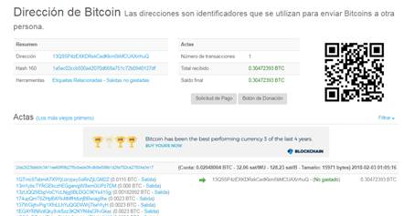

## Diplomado Fintech

### Criptografía - Sesión práctica

##### 12 de enero de 2019

#### 1. Cifrado

Vamos a utilizar la herramientaque se encuentra en la página [https://www.cryptool.org/en/cto-ciphers](https://www.cryptool.org/en/cto-ciphers).

En la pestaña **Ciphers**, seleccione `Caesar`. 

1. Confirme que el ejemplo de la presentación (DIPLOMADO FINTECH) genera el mensaje cifrado.  Para ello, deberá asegurarse que el desplazamiento (la llave) es igual a 3.

2. Agregue al alfabeto signos de puntuación, espacios y minúsculas y  genere un mensaje cifrado para el texto **¡Mi primer mensaje cifrado!** con una llave K=5.   Observe que en los signos de puntuación, no se contempla el caracter "¡".  Tendrá que definir su propio alfabeto. 

   *Compare sus resultados con los de sus compañeros.*

3. Investigue brevemente cómo funciona el cifrador `Porta`. Notará que es bastante similar a los cifradores Fersen.  Encripte el mensaje DIPLOMADO FINTECH con la palabra secreta ITAM.  
   *Compare sus resultados con los de sus compañeros.*

En la pestaña **Highlights**, seleccione `RSA (step-by-step)`.

* Verifique el ejemplo de la presentación (p =3, q=11, e = 9, Mensaje = 18,13).  
* ¿Por qué si en la presentación d = 19 y en el simulador d = 9, el resultado es el mismo?

#### 2. Hash

Vamos a utilizar la herramienta que se encuentra en la página [https://www.xorbin.com/tools/sha256-hash-calculator](https://www.xorbin.com/tools/sha256-hash-calculator).

1. Confirme que los ejemplos de la presentación generan los compendios presentados en la lámida del algoritmo MD5
2. Genere un hash con el algoritmo SHA-256 para el mensaje **¡Este es mi primer compendio digital!**.  *Compare sus resultados con los de sus compañeros*.
3. Escriba datos aleatorios tratando de buscar un compendio que empiece con al menos 4 bits, es decir, el primer dígito del hash (*un nibble*) debe ser **0**.  Por ejemplo, el mensaje *1234* genera un hash con esas características; de hecho, genera un hash con seis ceros -compruébelo.
   Ayuda: Uno de los mensajes que ha utilizado en esta sesión, genera un compendio como el solicitado.

Ahora vamos a utilizar un simulador muy didáctico para empezar a familiarizarnos con el uso de los compendios digitales en la Blockchain de Bitcoin.  Se encuentra en la página [https://anders.com/blockchain/](https://anders.com/blockchain/.)

1. Seleccione la pestaña **Hash** y en la ventana de datos, redacte una frase hasta que encuentre un compendio con al menos 6 ceros.  
   Una de las ventajas de este simulador, es que el hash se va creando automáticamente.
   *Muestre el resultado a sus compañeros*.

2. Seleccione la pestaña **Block**, agregue datos en la ventana correspondiente y de clic en *Mine*.  ¿Cuántos ceros tiene el compendio calculado? 

3. Introduzca el siguiente texto en el campo de datos y "mine" el bloque.  ¿Qué *nonce* obtuvo?

   Juan a Lety 10
   Elena a Lety 23
   Lety a Sara 14

4. Seleccione la pestaña **Blockchain**. agregue datos a los distintos bloques, mínelos en orden ascendente y observe cómo se van ligando a través del hash del bloque anterior.  
   NO DUDE EN PREGUNTARLE AL PROFESOR SI NO ENTIENDE MUY BIEN QUÉ ESTÁ OCURRRIENDO

5. Con todos los bloques en verde, modifique los datos del bloque 3 y observe cómo quedan invalidados los bloques 3 a 5.  Aún si recalcula el hash del bloque 3, los bloques 4 y 5 están aislados.  
   Durante la práctica, habrá observado que a veces toma algún tiempo obtener el hash.  Esta es la base del *Proof of Work*  en blockchain.

#### 3. Blockchain.info

[Blockchain.info](https://blockchain.info/) es un proveedor de monederos para Bitcoin (y recientemente, de Ethereum). También es una de las herramientas de exploración de la cadena de bloques de Bitcoin más populares. En esta sección únicamente veremos algunos aspectos relacionados con el uso de las funciones Hash en Bitcoin.  En las próximas sesiones conocerá con un poco más de profundidad cómo funciona el blockchain de Bitcoin.

En la página principal busque la sección en la que se encuentra una síntesis de los últimos bloques. En la columna Altura (se refiere a la longitud de la cadena), podemos seleccionar cualquier bloque. Aparecerá una página como la siguiente:

Podrá ver el compendio del bloque anterior, del actual y del siguiente. Observe la dificultad por el número de "0" con que inician los compendios. 

También encontramos bastante información del bloque, como el número de transacciones que contiene, el total en BTC intercambiado, las comisiones cobradas, el nonce (“mientras tanto”) y la recompensa pagada al minero.

**¿Qué bloque minó, cuántas transacciones tenía, cuál fue el promedio de comisión por transacción (en dólares), cuántos *bits* en cero tiene de prefijo el hash?**

 Al dar clic en el hash del bloque actual, aparece una página como la siguiente.

 

Al barrer hacia abajo la página, aparece información sobre las transacciones como se muestra en la figura:

 

El hash en los renglones sombreados identifica a esa transacción. En el renglón también aparece la hora en que llegó esa transacción.  

En el renglón de abajo aparecen las carteras de salida (a la izquierda) y de entrada (a la derecha).   Puede haber más de una cartera de salida para poder juntar el monto total a enviar, desde distintos fondos. *Esto puede afectar la comisión a pagar.*

El botón verde muestra el total de la transacción en BTC. Si damos clic en él, todos los valores de criptomoneda se convierten a dólares americanos.

Si damos clic al hash de la transacción, aparecerá una pantalla como la siguiente

 

En el resumen encontramos detalles de la transacción, como su tamaño y el costo en watts (peso), nuevamente la hora de recepción y el bloque en que fue registrada.  A la derecha se muestran el total de salida, de entrada y las comisiones pagadas.

### Una cartera

En la parte superior  podemos ver las carteras que fueron utilizadas en esta transacción. Al seleccionar una de ellas, se obtendrá información sobre esa cartera, como su dirección y el hash de la dirección. 

En Bitcoin, **la dirección es el hash de la llave pública** de la cartera, codificada con un código especial (Base58) que elimina caracteres que pueden confundirse (como "1" y "l" o "o" y "0").  

A la derecha se observa un resumen de las transacciones y los fondos que aún quedan disponibles.  Las transacciones que ha realizado se muestran cronológicamente en la parte inferior.

 

